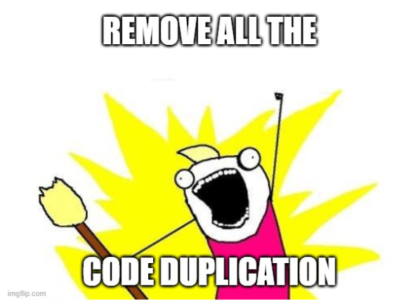

# Problemstellung

Es kommt in der Softwareentwicklung sehr häufig vor, dass verschiedene Objekte verwendet werden, die viele Gemeinsamkeiten besitzen und nur wenige Unterschiede. 

Da die Grundidee in der objektorientierten Programmierung die ist, dass jede Gelegenheit genutzt werden soll, bestehenden Code zu verwenden, wurde die Vererbung von Klassen ins Leben gerufen.

Man könnte es auch so formulieren, dass ein guter Entwickler möglichst "faul" sein sollte, im Sinne von: 

> *Was ein\*e Andere\*r schon gemacht hat, nutze ich, statt es selbst zu machen!*

Um dies zu realisieren werden wir in den folgenden Kapiteln darstellen, wie Vererbung in der Softwareentwicklung funktioniert und was abstract-Klassen und -Methoden sind.

Weiters gilt eine weitere Grundregel: 

> *jede Software soll möglichst modular aufgebaut werden, damit Teile leicht ausgetauscht werden können!*

Zu diesem Thema werden wir lernen, was Schnittstellen sind und wie diese anzuwenden sind.