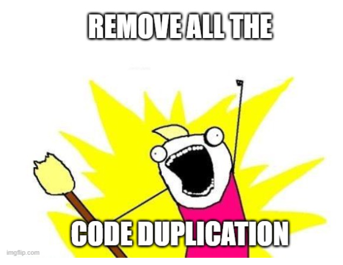

# Wie funktioniert die Vererbung von Klassen?

Nehmen wir wieder unser Beispiel von RPG-Game mit den verschiedenen Charakteren. 

## Implementierung ohne Vererbung

Der erste Ansatz wäre eine ohne Vererbung. Allerdings müssten wir einige Methoden mehrmals schreiben. Wir würden also folgende Klassen benötigen: Wizard, Elf, Warrior (und eigentlich könnten wir genauso noch weitere definieren wie King, Hobbit, Dwarf, Eagle, Orc, ... Das würde aber diesen Kurs sprengen und wenig Mehrwert bringen, somit beschränken wir uns auf die ersten 3 Klassen.)

Die Klassen würde so aussehen (*ACHTUNG! Jede Klasse gehört in eine eigene Datei!*):

### Java

```java
public class Warrior {
    private String name;
    private String gender;
    private Integer healthPoints;

    public Warrior(String name, String gender, Integer healthPoints) {
        this.name = name;
        this.gender = gender;
        this.healthPoints = healthPoints;
    }

    public void swingSword() {
        System.out.println("pheeew \uD83D\uDDE1️ ");
    }
}
```

```java
public class Wizard {
    private String name;
    private String gender;
    private Integer healthPoints;

    public Wizard(String name, String gender, Integer healthPoints) {
        this.name = name;
        this.gender = gender;
        this.healthPoints = healthPoints;
    }

    public void makeMagic() {
        System.out.println("Magic! \uD83E\uDE84");
    }
}
```

```java
public class Elf{
    private String name;
    private String gender;
    private Integer healthPoints;

    public Elf(String name, String gender, Integer healthPoints) {
        this.name = name;
        this.gender = gender;
        this.healthPoints = healthPoints;
    }

    public void shootArrow() {
        System.out.println("---> ");
    }
}
```

### C#

```c#

```

Man erkennt auf dem ersten Blick, dass die 3 Attribute und der Konstruktor in allen 3 Klassen gleich aussehen. 

Stellen wir uns vor, alle unsere Charaktere sollen ein weiteres Attribut bekommen: strength. So wie wir angefangen haben, müssten wir allen 3 Klassen das neue Attribut verpassen und die 3 Konstruktoren ergänzen. 

Wenn ihr euch erinnert, ist das große Ziel eines Entwickler ein und denselben Code nur 1 Mal schreiben zu müssen. Hier spielt die Vererbung von Klassen eine große Rolle:

## Implementierung mit Vererbung

Wie im vorigen Kapitel erklärt möchten wir die Klassenstruktur wie folgt aufbauen:

RPGCharacter wird unsere Basisklasse, von der die anderen Charakterklassen erben werden. Da wir keinen Charakter vom Typ RPGCharakter instanzieren möchten (Der Charakter hätte keine Spezialfähikeit und könnte somit nicht kämpfen. Also macht dieser Charakter keinen Sinn für unser Spiel), wird es eine **abstract**-Klasse. Diese erlaubt uns, 3 weitere abgeleitete Klassen zu definieren: Wizard, Elf, Warrior.

### Definition der Basisklasse

Definieren wir zuerst die Basisklasse:

#### Java

```java
public abstract class RPGCharacter {
    private String name;
    private String gender;
    private Integer healthPoints;

    public RPGCharacter(String name, String gender, Integer healthPoints) {
        this.name = name;
        this.gender = gender;
        this.healthPoints = healthPoints;
    }
    
    // Eventuell könnten hier Getter & Setter implementiert werden, um zB die Werte zu überprüfen
    // bevor sie gespeichert werden.
}
```

#### C#

```c#

```



> [!IMPORTANT]
> Auch wenn die Klasse RPGCharacter einen Konstruktor besitzt, kann diese nicht instanziert werden, weil sie **abstract** ist. Lediglich ihre Subklassen können den Konstruktor verwenden!

Eine Basisklasse kann eine **abstract**-Klasse sein, muss aber nicht. Eine ganz normale Klasse kann auch vererbt werden, mit dem Unterschied, dass eine normale Klasse instanziert werden kann.

Zur Wiederholung: die Basisklasse beinhaltet alle Bestandteile, die sich in den Subklassen wiederholen würden.

### Subklassen

Nachdem die Basisklasse definiert wurde, können wir uns den Subklassen widmen. Um eine Subklasse zu erstellen verwendet man nach dem Klassennamen das Schlüsselwort **extends** (erweitert) und anschließend der Name der Basisklasse. Hier: RPGCharacter.

Ein weiterer wichtiger Punkt ist das Schlüsselwort **super**. Dieses Schlüsselwort bedeutet soviel wie: führe den entsprechenden Code aus der Basisklasse aus. In unserem Beispiel wenden wir diesen im Konstruktor an, also wird hier der Konstruktor der RPGCharacter-Klasse angewendet. Würde dieser in einer Methode vorkommen, würde jene Methode der Basisklasse mit demselben Namen und die angegebenen Parameter aufgerufen werden.

#### Java

```java
public class Warrior extends RPGCharacter {

    public Warrior(String name, String gender, Integer healthPoints) {
        super(name, gender, healthPoints);
    }

    public void swingSword() {
        System.out.println("pheeew \uD83D\uDDE1️ ");
    }
}
```

```java
public class Wizard extends RPGCharacter {
    public Wizard(String name, String gender) {
        super(name, gender, 3);
    }
    public void makeMagic() {
        System.out.println("Magic! \uD83E\uDE84 ✨️ ");
    }
}
```

```java
public class Elf extends RPGCharacter {
    
    public Elf(String name, String gender) {
        super(name, gender, Integer.MAX_VALUE);
    }

    public void shootArrow() {
        System.out.println("---> \uD83D\uDC9A");
    }
}
```

#### C#

```c#

```

## Verwendung von vererbten Klassen

Ein weiterer Vorteil der Vererbung ist der, dass man daraus zum Beispiel eine Liste von RPGCharacter erstellen kann, in der sowohl Krieger, Zauberer als auch Elfen drinnen sind. Das funktioniert, weil durch die Vererbung definiert ist, dass Krieger, Zauberer und Elfen auch als RPGCharacter gelten.

Bei der Variante ohne Vererbung müssten wir eine Liste von Objekten erstellen, was nicht sonderlich aussagekräftig ist. 

> [!IMPORTANT]
> Hier wieder eine wichtige Regel in der Softwareentwicklung: Damit dein Code möglichst verständlich ist, verwende immer den spezifischsten Datentyp/die spezifischste Klasse, die du verwenden kannst.

Hier ein Beispielprogramm:

### Java

```java
public static void main(String[] args) {
    List<RPGCharacter> allCharacters = new ArrayList<>();
    Warrior aragorn = new Warrior("Aragorn", "male", 10);
    Wizard gandalf = new Wizard("Gandalf the Grey", "male");
    Elf legolas = new Elf("Legolas", "male");
    allCharacters.add(aragorn);
    allCharacters.add(gandalf);
    allCharacters.add(legolas);
    System.out.println(allCharacters);
}
```

Diese Methode würde folgendes ausgeben:

```
[com.codersbay.heroes.Warrior@6acbcfc0, com.codersbay.heroes.Wizard@5f184fc6,
com.codersbay.heroes.elfs.Elf@3feba861]
```

### C#

```c#

```

Obwohl wir also die einzelnen Instanzen in einer Liste von RPGCharacter speichern, sehen wir durch die Ausgabe auf die Konsole dass die einzelnen Elemente sehr wohl noch ihren konkreten Typ haben!
Das heißt aragon wird zwar zu der Liste von Charakteren als RPGCharacter hinzugefügt, bleibt aber
trotzdem noch ein Krieger genauso wie gandalf ein Zauberer bleibt.

